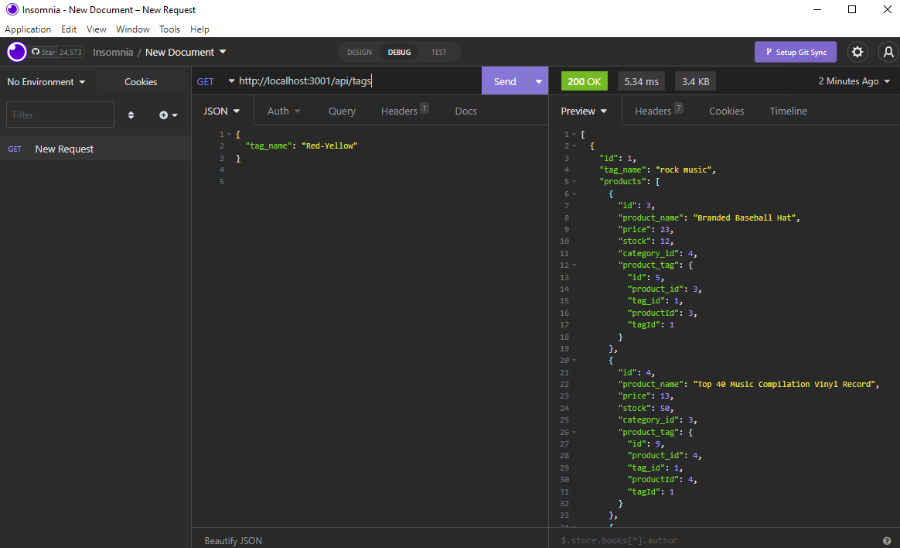

# ECOMMERCE BACKEND

This application is a fully functional express and sequelize database manager.  
All of the routes use relational table mapping and CRUD to integrate full control  
over the DB.

[Video of app execution](https://drive.google.com/file/d/1WLhfjuIfoRvpiVbWvalJ4D9P_eaPB8HP/view)

## Description

In this application, the user can run the program seeds and use an API  
platform such as Insomnia or Postman, to test the CRUD methods on each route.  
The database should always maintain or update the relationships using sequelize.

### Installing

To install dependencies, simply run the command 'npm i'.

### Executing program

To execute the program run the command, 'node seeds/index.js' to seed the database, followed by the command  
'npm start', to start the server.

### Testing

No testing currently available.

## Authors

Dylan Crowley:

[Github](https://github.com/dcrowdev)  
[Twitter](https://twitter.com/dcrowdev)  
[LinkedIn](https://www.linkedin.com/in/dylan-crowley-3974b8252/)  
dcrowdev1025@gmail.com

## License

This project is licensed under the MIT license.

## Acknowledgments

UCF Fullstack bootcamp!